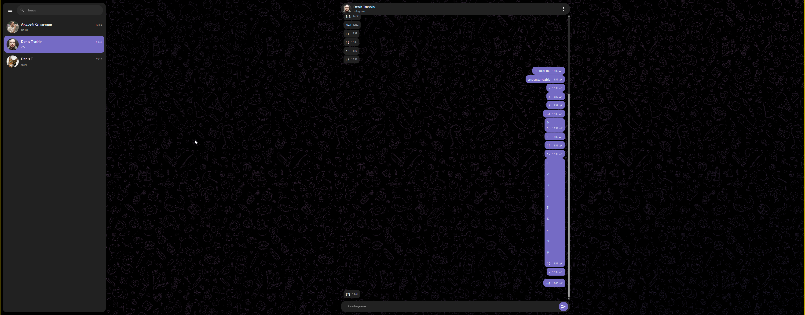

# Telegram Chat · GREEN-API

Тестовое React-приложение для отправки и получения текстовых сообщений в Telegram через GREEN-API.

## Запуск

Нужен Node.js 20.19+ или 22.12+ и Yarn 4.18 (через Corepack).

```bash
yarn install
yarn dev
```

Vite выведет локальный адрес приложения. Проверки:

```bash
yarn check
```

## GitHub Pages

Публикация выполняется GitHub Actions при каждом push в `master`.
Workflow собирает приложение с базовым путём репозитория, поэтому локальный
запуск и preview по-прежнему используют `/`. В репозитории включён источник
`Settings → Pages → Build and deployment → GitHub Actions`.

## Подготовка Telegram-инстанса

1. Создайте и авторизуйте Telegram-инстанс в [консоли GREEN-API](https://console.green-api.com/).
2. В приложении введите `idInstance` и `apiTokenInstance`.
3. Если уведомления не настроены, нажмите «Настроить». Это очищает существующий `webhookUrl` (внешняя интеграция перестанет получать события), включает HTTP-уведомления и перезапускает инстанс. Приложение повторно проверяет состояние и настройки; если они ещё не применились, повторите действие позже.
4. Создайте чат по номеру телефона в международном формате, например `79991234567`.
5. Отправьте сообщение и ответьте на него с другого Telegram-аккаунта.

## Что реализовано

- проверка авторизации инстанса и его настроек;
- создание чата через `checkAccount`;
- optimistic-отправка сообщений через `sendMessage`;
- получение уведомлений через последовательный `receiveNotification` → обработка → `deleteNotification`;
- статусы исходящих сообщений и дедупликация;
- адаптивная desktop/mobile вёрстка на MUI;
- тёмная тема;
- Enter отправляет сообщение, Shift+Enter добавляет перенос строки;
- последние 100 сообщений при открытии чата и локальная история в `sessionStorage`;
- Effector-модели в минимальной FSD-структуре.

## Технические решения

Приложение обращается в GREEN-API напрямую из браузера. CORS preflight и browser request проверены для API-хоста, поэтому отдельный backend или Vite proxy для тестового не нужны.

Токен и idInstance сохраняются в `sessionStorage` текущей вкладки для восстановления подключения после перезагрузки. Менеджер паролей браузера также может предложить сохранить данные. Выход удаляет сохранённый токен, но локальная история чатов остаётся в `sessionStorage` для этого idInstance до закрытия вкладки или очистки данных сайта. Не используйте общедоступный компьютер с реальным токеном.

Получение построено без `setInterval`: следующий запрос очереди запускается после ответа `receiveNotification` или успешного `deleteNotification`. История загружается при выборе чата, без второго периодического опроса.

## Ограничения

- Только текстовые сообщения.
- Подгружаются до 100 последних сообщений; более ранние сообщения недоступны в интерфейсе.
- Хост API зафиксирован на `https://4100.api.green-api.com`; для инстансов на другом хосте требуется изменить подключение в коде.
- После неопределённой сетевой ошибки отправки сначала проверьте доставку в Telegram: повторная отправка может создать дубль.
- Автоматические тесты не работают с реальным Telegram-инстансом и не проверяют мобильный браузер; приложение дополнительно проверено вручную на реальных инстансах.
- Не открывайте один инстанс в двух вкладках: они разделят очередь уведомлений.
- Для production следует вынести API-вызовы в защищённый серверный слой, поскольку токен является частью URL GREEN-API.

## Демо




[Скачать видео демо (MP4, 1.0 MB)](docs/media/demo-video.mp4)

## Ссылки

- [SendMessage](https://green-api.com/telegram/docs/api/sending/SendMessage/)
- [Получение уведомлений через HTTP API](https://green-api.com/telegram/docs/api/receiving/technology-http-api/)
- [SetSettings](https://green-api.com/telegram/docs/api/account/SetSettings/)
